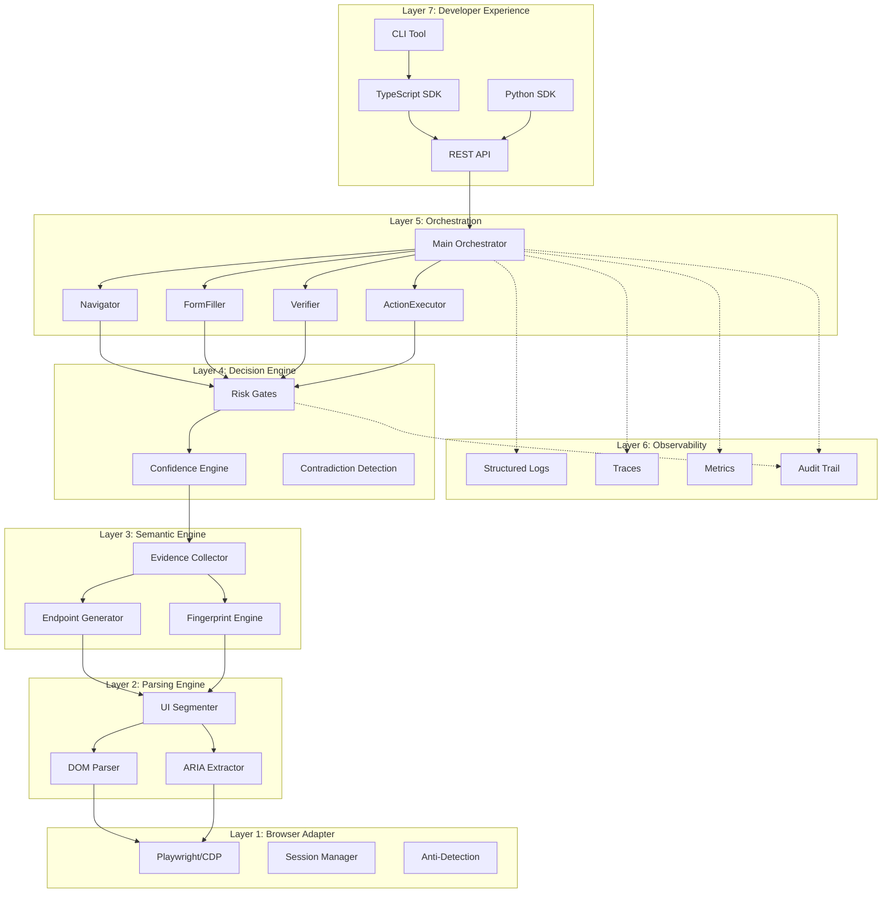

# BALAGE

> Semantic Verification Layer for AI-Browser Interaction

BALAGE versteht Web-Interfaces semantisch — nicht visuell. Es liefert typisierte Endpoints, kalibrierte Confidence Scores und evidenzbasierte Risk Gates fuer KI-Systeme die mit dem Web interagieren.

---

## Why BALAGE?

### Das Problem

KI-Systeme die mit dem Web interagieren arbeiten heute nach dem Prinzip "Screenshot + Pray": Ein LLM bekommt ein Bild der Seite, raet wo geklickt werden soll und hofft dass es funktioniert. Es gibt keine Verifikation, keine Confidence, keine Sicherheitsschicht.

Das fuehrt zu:

- **Fehlklicks auf Hidden Fields** die visuell nicht sichtbar sind
- **Unkalibrierte Confidence** — das System sagt "sicher" auch wenn es raten muesste
- **Keine Sicherheit** bei autonomen Aktionen wie Zahlungen oder Dateneingaben
- **Brittle Selektoren** die bei jedem UI-Update brechen

### Die 3 Saeulen

**1. Semantische Endpoints**
BALAGE parst den DOM direkt, extrahiert ARIA-Rollen, baut semantische Fingerprints und klassifiziert was ein Interface-Element *ist* und *tut*. Kein Screenshot-Raten, sondern strukturelles Verstaendnis.

**2. Confidence und Evidence**
Jeder erkannte Endpoint traegt einen kalibrierten Confidence Score und eine Evidence Chain: eine Liste unabhaengiger Signale die erklaeren *warum* BALAGE zu dieser Einschaetzung kommt. Kalibriert heisst: Confidence 0.85 = korrekt in ~85% der Faelle (Ziel: Brier Score < 0.1).

**3. Risk-Gated Actions**
Jede Aktion durchlaeuft ein Risk Gate. Leseaktionen brauchen niedrigere Confidence als Formular-Submissions; Zahlungen verlangen >0.92. Der Default ist DENY. Widersprueche zwischen Evidenz-Quellen erhoehen die Schwelle automatisch.

---

## Architecture Overview

BALAGE ist als 7-Schichten-Stack aufgebaut. Jede Schicht hat eine klar definierte Verantwortung und kommuniziert ueber typisierte Interfaces (`shared_interfaces.ts`).



Detaillierte Beschreibung jeder Schicht: [Architecture](./architecture.md)

---

## Design Targets

Die folgenden Werte sind Design-Ziele auf Basis der MASTERSPEC-Analyse. Sie sind nicht validierte Messergebnisse, sondern die Schwellen gegen die BALAGE getestet werden soll.

| Metrik | Design-Ziel | Vergleichsklasse |
|--------|------------|------------------|
| Endpoint-Erkennung Precision | > 0.90 | Vision-only Baseline |
| Endpoint-Erkennung Recall | > 0.85 | Vision-only Baseline |
| Confidence-Kalibrierung (Brier) | < 0.10 | Unkalibrierte Systeme (~0.22) |
| Hidden-Field-Erkennung | 100% | Vision-only (0%) |
| Latency P50 (Endpoint Discovery) | < 200ms | Vision-Roundtrip (~900ms) |
| Fingerprint-Stabilitaet bei UI-Updates | > 0.85 Similarity | CSS-Selektor-basiert (bricht) |

Kill-Kriterium aus der MASTERSPEC: Wenn nach 60 Tagen kein messbarer Vorteil (>15% Reliability-Improvement vs. Vision-only), wird pivotiert oder gestoppt.

---

## Current Status

**Technical Preview** — Architektur komplett, Real-World-Validierung steht aus.

Was existiert:
- 7-Layer-Architektur mit typisierten Interfaces (`shared_interfaces.ts`)
- Confidence Engine mit Platt-Scaling-Kalibrierung
- Risk Gate Engine mit 6 Action-Klassen und Contradiction Detection
- Semantischer Endpoint Generator mit Fingerprinting
- REST API Server (Hono-basiert)
- TypeScript SDK und Python SDK (Quellcode, nicht publiziert)
- Audit Trail mit Evidence Chains
- 100+ Unit- und Integrationstests

Was fehlt:
- Publizierte Pakete (npm/PyPI)
- Real-World-Benchmarks gegen Live-Websites
- Production-Deployment-Erfahrung
- Performance-Optimierung unter Last

---

## Development Setup

```bash
git clone <repository-url>
cd balage-ainw
npm install
npm test
```

TypeScript-Kompilierung pruefen:

```bash
npx tsc --noEmit
```

---

## Was BALAGE ist — und was nicht

Direkt aus der [MASTERSPEC](../MASTERSPEC/01_EXECUTIVE_SUMMARY.md):

| BALAGE ist | BALAGE ist nicht |
|-----------|-----------------|
| Eine Semantik- und Wahrheitsschicht ueber Interfaces | Ein reiner Screenshot-/Vision-Executor |
| Ein System fuer inferred und spaeter verified Endpoints | Ein Playwright-Wrapper mit LLM |
| Ein risk-aware Controller fuer UI-Aktionen | "Ein ganzer Agent fuer das ganze Internet" |
| Potenziell eine Infrastruktur-Schicht fuer AI-ready Interfaces | Primaer ein Desktop-Automation-Produkt |
| Modellagnostisch (OpenAI, Claude, lokale Modelle) | An ein einzelnes LLM gebunden |

BALAGE ersetzt keine Agents — es macht Agents zuverlaessiger. Ein Agent entscheidet *was* getan werden soll; BALAGE verifiziert *ob* die Aktion sicher, korrekt und auf dem richtigen Element ausgefuehrt wird.

---

## Documentation

- [Architecture](./architecture.md) — 7-Layer-Stack im Detail
- [Core Concepts](./concepts.md) — Endpoints, Fingerprints, Confidence, Risk Gates
- [API Reference](./api-reference.md) — REST-Endpoints mit Beispielen
- [SDK Guide](./sdk-guide.md) — TypeScript und Python SDK
- [CLI Reference](./cli-reference.md) — Command-Line Tools

## License

MIT
