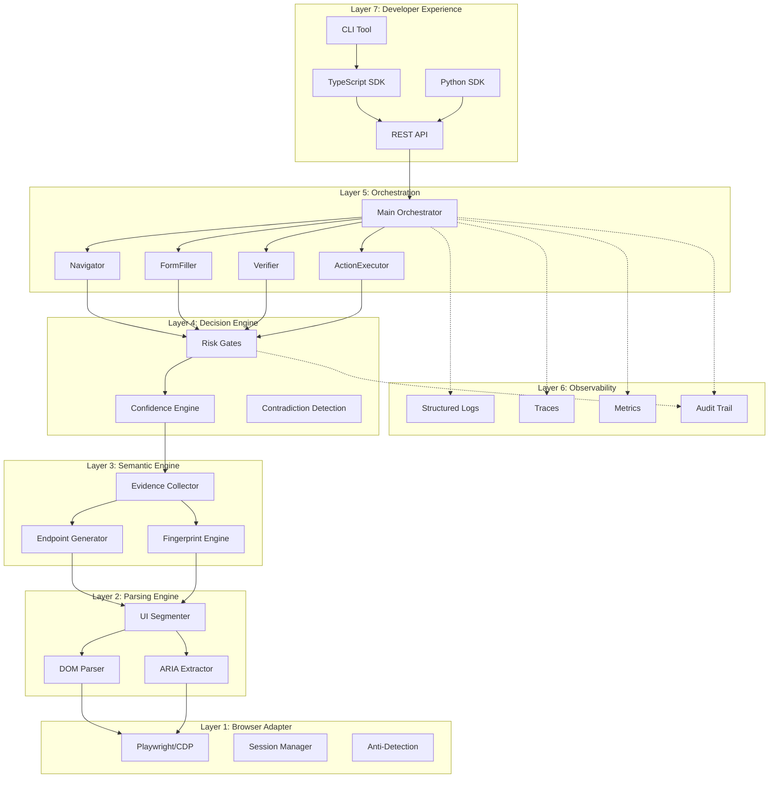

# Architecture Overview

BALAGE is built as a 7-layer stack. Each layer has a single responsibility and communicates with adjacent layers through typed interfaces defined in `shared_interfaces.ts`.

For the full diagrams, see [Architecture Diagram](./assets/architecture-diagram.md).

## System Diagram



## The 7 Layers

### Layer 1: Browser Adapter

The Browser Adapter provides a controlled interface to web browsers via Playwright and the Chrome DevTools Protocol (CDP). It handles page navigation, session management, and anti-detection measures.

This layer exists because BALAGE needs reliable, reproducible browser sessions. Anti-detection (randomized timing, Bezier mouse curves, viewport jitter) ensures that automation behaves like a real user, preventing bot detection that would break workflows.

**Key components:**
- Playwright/CDP integration (Chromium, Firefox, WebKit)
- Session Manager with configurable viewport, locale, and timezone
- Anti-detection: humanized timing, mouse movement, fingerprint rotation
- CAPTCHA detection with configurable escalation strategy
- Proxy support (residential, datacenter, mobile) with rotation

**Configuration:** `BrowserAdapterConfig` in `shared_interfaces.ts`

### Layer 2: Parsing Engine

The Parsing Engine extracts structured data from raw browser output. It builds a DOM tree, an Accessibility (ARIA) tree, and segments the page into logical UI regions.

Raw HTML is not useful for semantic reasoning. This layer transforms the visual chaos of a web page into structured, labeled regions that the Semantic Engine can reason about. UI Segmentation identifies forms, navigation bars, modals, and content areas.

**Key components:**
- DOM Parser: Extracts `DomNode` trees with visibility, interactivity, and bounding boxes
- ARIA Extractor: Builds `AccessibilityNode` trees with roles, states, and relationships
- UI Segmenter: Groups DOM nodes into `UISegment` regions (form, navigation, content, header, footer, sidebar, modal, overlay, banner, table, list, media)

**Types:** `DomNode`, `AccessibilityNode`, `UISegment` in `shared_interfaces.ts`

### Layer 3: Semantic Engine

The Semantic Engine transforms parsed UI data into meaningful endpoints. It uses LLM inference to identify what each interactive element *means*, builds stable fingerprints, and collects evidence for every interpretation.

This is where BALAGE diverges from vision-only approaches. Instead of guessing from screenshots, it reasons over structured DOM data, ARIA labels, and text content. The LLM generates semantic interpretations that are then validated by evidence from multiple sources.

**Key components:**
- Endpoint Generator: LLM-based inference that maps UI segments to semantic endpoints (e.g., "this is a login form")
- Fingerprint Engine: Creates stable hashes of endpoint features that survive DOM changes
- Evidence Collector: Gathers signals from DOM, ARIA, text content, layout, and LLM inference

**Types:** `Endpoint`, `SemanticFingerprint`, `Evidence` in `shared_interfaces.ts`

### Layer 4: Decision Engine

The Decision Engine calculates confidence scores and enforces risk gates. Every action must pass through a gate before execution.

Confidence without calibration is meaningless. This layer ensures that a confidence of 0.85 actually means "correct 85% of the time" through Platt Scaling. Risk Gates enforce the principle of *default deny* — actions are blocked unless evidence is sufficient.

**Key components:**
- Confidence Engine: Weighted formula combining 6 signals into a calibrated score
- Risk Gates: Threshold-based decisions (ALLOW, DENY, ESCALATE) per action class
- Contradiction Detection: Identifies conflicting evidence that reduces trust

**Confidence formula:**

```
score = w1 * semanticMatch + w2 * structuralStability + w3 * affordanceConsistency
      + w4 * evidenceQuality + w5 * historicalSuccess - w6 * ambiguityPenalty
```

**Types:** `ConfidenceScore`, `GateDecision`, `PolicyRule` in `shared_interfaces.ts`

### Layer 5: Orchestration

The Orchestration layer coordinates multi-step workflows using specialized sub-agents. It executes workflow steps as a directed acyclic graph (DAG) with parallel execution, error handling, and rollback support.

Complex browser tasks (e.g., "log in, find the settings page, change the email") require multiple sequential and parallel steps. The Orchestrator manages agent lifecycles, enforces budgets, and handles errors gracefully.

**Key components:**
- Main Orchestrator: DAG execution engine with parallel/sequential step management
- Sub-Agents: Navigator, FormFiller, Verifier, ActionExecutor, Authenticator, DataExtractor, ErrorHandler, ConsentManager
- Each agent has limited capabilities (least privilege), action budgets, timeouts, and cost limits

**Types:** `WorkflowDefinition`, `WorkflowStep`, `SubAgent`, `AgentTask`, `AgentResult` in `shared_interfaces.ts`

### Layer 6: Observability

The Observability layer records everything BALAGE does. Every decision, action, and result is traced, logged, and auditable.

When a workflow fails or produces unexpected results, you need to understand *why*. The audit trail provides full transparency: which agent did what, what evidence supported the decision, and what the risk gate said.

**Key components:**
- Structured Logging: JSON logs with configurable levels (debug, info, warning, error, critical)
- Traces: Distributed tracing with `traceId` correlation across all operations
- Metrics: Performance, cost, and accuracy tracking with configurable sampling
- Audit Trail: Immutable record of every decision with actor, action, evidence chain, and outcome

**Types:** `AuditEntry` in `shared_interfaces.ts`

### Layer 7: Developer Experience

The Developer Experience layer provides all the interfaces developers use to interact with BALAGE: a REST API, TypeScript and Python SDKs, and a CLI tool.

BALAGE is only useful if developers can integrate it quickly. This layer ensures that the full power of the system is accessible through familiar tools and patterns.

**Key components:**
- REST API: Fastify-based server with authentication, rate limiting, WebSocket streaming, and idempotency
- TypeScript SDK (`@balage-osaka/sdk`): Client with fluent WorkflowBuilder, streaming, auto-retry
- Python SDK (`balage`): Async client with Pydantic v2 models, context manager pattern
- CLI (`@balage-osaka/cli`): Commander.js-based tool with init, run, test, and status commands

**See also:**
- [API Reference](./api-reference.md)
- [SDK Guide](./sdk-guide.md)
- [CLI Reference](./cli-reference.md)

## Data Flow

A typical BALAGE workflow follows this path:

1. **User submits workflow** via SDK, CLI, or REST API
2. **API Server** validates the request and starts the Orchestrator
3. **Orchestrator** assigns the first step to a Sub-Agent (e.g., Navigator)
4. **Browser Adapter** opens the target page via Playwright
5. **Parsing Engine** extracts the DOM tree, ARIA tree, and segments the UI
6. **Semantic Engine** generates endpoints using LLM inference, builds fingerprints, collects evidence
7. **Decision Engine** calculates confidence scores and checks risk gates
8. **If ALLOW:** the Sub-Agent executes the action through the Browser Adapter
9. **If DENY/ESCALATE:** the Orchestrator handles the rejection (retry, skip, abort, or escalate)
10. **Observability** records every decision in the audit trail
11. **API Server** returns the workflow result to the user

## Key Design Decisions

### 1. Semantic over Visual

BALAGE parses the DOM and ARIA tree instead of relying on screenshots. This means it can detect hidden form fields, understand ARIA roles, and reason about page structure — things that are invisible in a screenshot.

### 2. Evidence-Based Confidence

Every endpoint interpretation is backed by an evidence chain. Confidence scores are not arbitrary — they are calculated from weighted signals (semantic labels, ARIA roles, structural patterns, text content, layout, history) and calibrated with Platt Scaling to produce reliable probabilities.

### 3. Default-Deny Risk Gates

Safety is the default. Every action passes through a risk gate that checks confidence, contradiction scores, and evidence count against the action's risk class. Higher-risk actions (financial, destructive) require higher confidence. If in doubt, the gate denies.

### 4. Fingerprint-Based Stability

Semantic Fingerprints hash the *meaning* of an endpoint, not its DOM position. When a website redesigns its CSS or restructures its HTML, the fingerprint stays stable as long as the semantic purpose hasn't changed. Drift detection triggers re-evaluation only when significant changes are detected.
