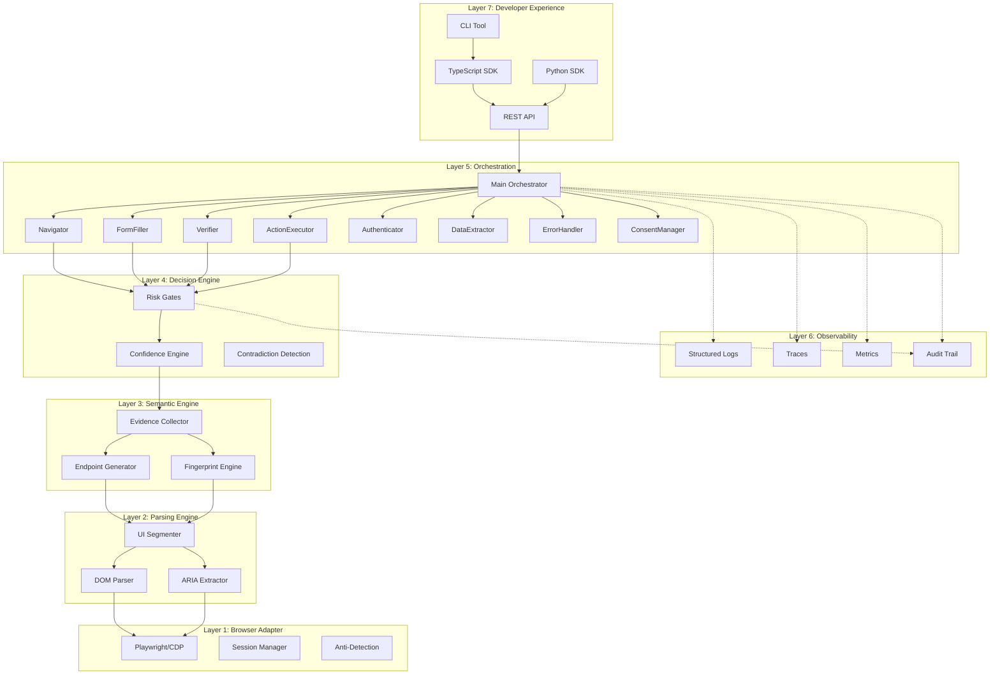
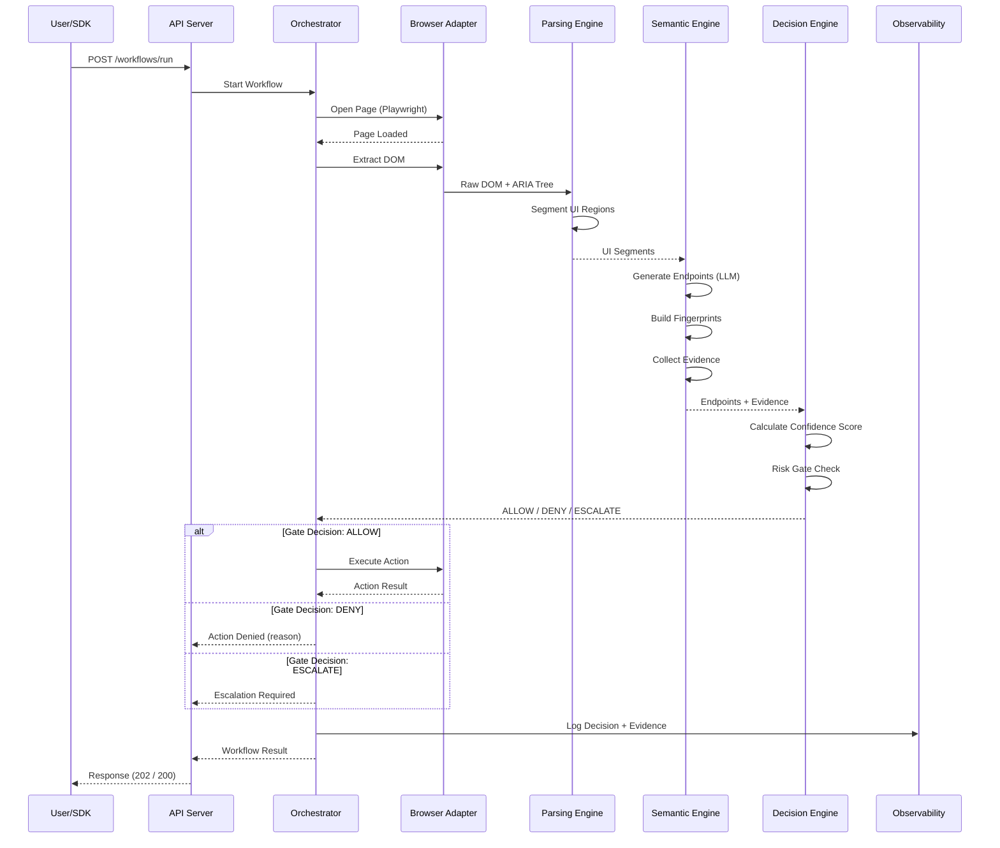
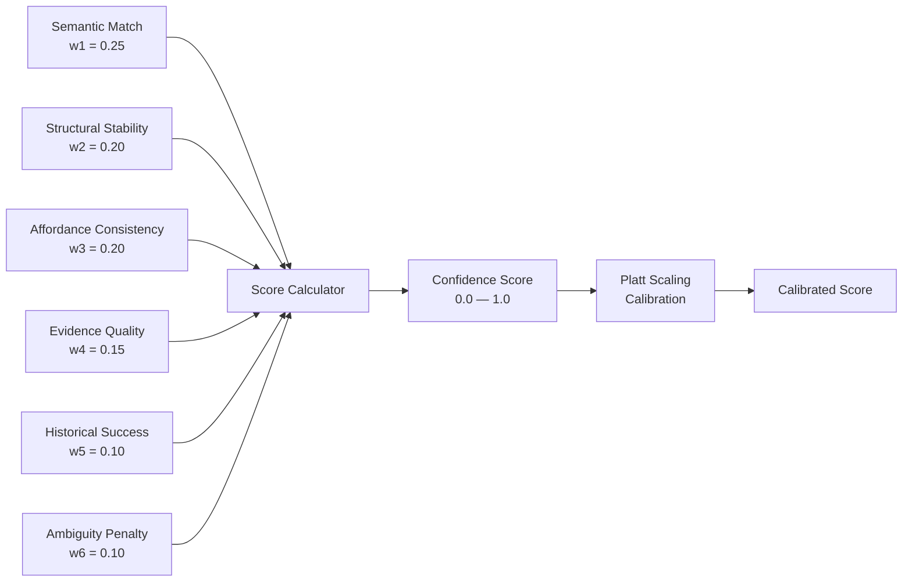
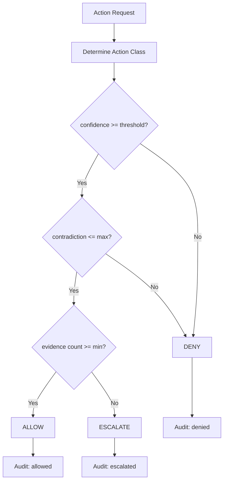

# Architecture Diagram

## System Overview

```mermaid
graph TB
    subgraph "Layer 7: Developer Experience"
        API[REST API]
        SDK_TS[TypeScript SDK]
        SDK_PY[Python SDK]
        CLI[CLI Tool]
    end

    subgraph "Layer 6: Observability"
        LOG[Structured Logs]
        TRACE[Traces]
        METRICS[Metrics]
        AUDIT[Audit Trail]
    end

    subgraph "Layer 5: Orchestration"
        ORCH[Main Orchestrator]
        NAV[Navigator]
        FORM[FormFiller]
        VER[Verifier]
        EXEC[ActionExecutor]
        AUTH_AGENT[Authenticator]
        EXTRACT[DataExtractor]
        ERR[ErrorHandler]
        CONSENT[ConsentManager]
    end

    subgraph "Layer 4: Decision Engine"
        CONF[Confidence Engine]
        RISK[Risk Gates]
        CONTRA[Contradiction Detection]
    end

    subgraph "Layer 3: Semantic Engine"
        EPGEN[Endpoint Generator]
        FPENG[Fingerprint Engine]
        EVID[Evidence Collector]
    end

    subgraph "Layer 2: Parsing Engine"
        DOM[DOM Parser]
        ARIA[ARIA Extractor]
        SEG[UI Segmenter]
    end

    subgraph "Layer 1: Browser Adapter"
        PW[Playwright/CDP]
        SESS[Session Manager]
        ANTI[Anti-Detection]
    end

    SDK_TS --> API
    SDK_PY --> API
    CLI --> SDK_TS

    API --> ORCH
    ORCH --> NAV & FORM & VER & EXEC
    ORCH --> AUTH_AGENT & EXTRACT & ERR & CONSENT
    NAV & FORM & VER & EXEC --> RISK
    RISK --> CONF
    CONF --> EVID
    EVID --> EPGEN & FPENG
    EPGEN & FPENG --> SEG
    SEG --> DOM & ARIA
    DOM & ARIA --> PW

    ORCH -.-> LOG & TRACE & METRICS & AUDIT
    RISK -.-> AUDIT
```

## Data Flow

```mermaid
sequenceDiagram
    participant U as User/SDK
    participant A as API Server
    participant O as Orchestrator
    participant B as Browser Adapter
    participant P as Parsing Engine
    participant S as Semantic Engine
    participant D as Decision Engine
    participant Ob as Observability

    U->>A: POST /workflows/run
    A->>O: Start Workflow
    O->>B: Open Page (Playwright)
    B-->>O: Page Loaded

    O->>B: Extract DOM
    B->>P: Raw DOM + ARIA Tree
    P->>P: Segment UI Regions
    P-->>S: UI Segments

    S->>S: Generate Endpoints (LLM)
    S->>S: Build Fingerprints
    S->>S: Collect Evidence
    S-->>D: Endpoints + Evidence

    D->>D: Calculate Confidence Score
    D->>D: Risk Gate Check
    D-->>O: ALLOW / DENY / ESCALATE

    alt Gate Decision: ALLOW
        O->>B: Execute Action
        B-->>O: Action Result
    else Gate Decision: DENY
        O-->>A: Action Denied (reason)
    else Gate Decision: ESCALATE
        O-->>A: Escalation Required
    end

    O->>Ob: Log Decision + Evidence
    O-->>A: Workflow Result
    A-->>U: Response (202 / 200)
```

## Confidence Score Calculation

```mermaid
graph LR
    SM[Semantic Match<br/>w1 = 0.25] --> CALC[Score Calculator]
    SS[Structural Stability<br/>w2 = 0.20] --> CALC
    AC[Affordance Consistency<br/>w3 = 0.20] --> CALC
    EQ[Evidence Quality<br/>w4 = 0.15] --> CALC
    HS[Historical Success<br/>w5 = 0.10] --> CALC
    AP[Ambiguity Penalty<br/>w6 = 0.10] --> CALC

    CALC --> SCORE[Confidence Score<br/>0.0 — 1.0]
    SCORE --> PLATT[Platt Scaling<br/>Calibration]
    PLATT --> FINAL[Calibrated Score]
```

## Risk Gate Decision Flow

```mermaid
flowchart TD
    START[Action Request] --> CLASS[Determine Action Class]
    CLASS --> THRESH{confidence >= threshold?}

    THRESH -->|Yes| CONTRA{contradiction <= max?}
    THRESH -->|No| DENY[DENY]

    CONTRA -->|Yes| EVID{evidence count >= min?}
    CONTRA -->|No| DENY

    EVID -->|Yes| ALLOW[ALLOW]
    EVID -->|No| ESCALATE[ESCALATE]

    DENY --> AUDIT_D[Audit: denied]
    ALLOW --> AUDIT_A[Audit: allowed]
    ESCALATE --> AUDIT_E[Audit: escalated]
```
